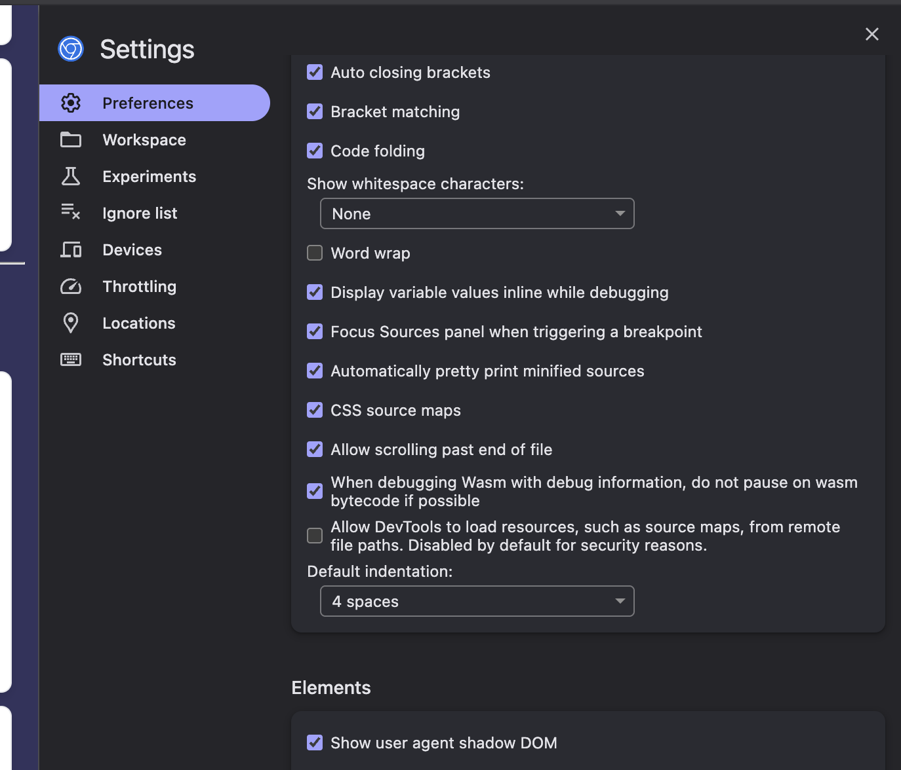

# 1.JSX
It supports jsx , allow to use / write html code in js

# 2.Single Page Application (SPA)
Meaning it is sinlge page that is index.html , using bundle it will render all react componets script which is added in index.html, it has root element from which we render all react components 

# 3. Advantages (SPA) 
  * Easy to route , no page reload when routing happens.
  * Component based ui
  * Centralized state mangement (Context API, Redux, Zustand)

# 4. Client side rendering
  Download bundle on intial load of web page , more initial load time

# 5. Server side rendering
    Some html like initial html rendered from server , directly get html , disply to user, increase initail load time 

# 6.Stateless components
  compomets which does not have their own state are stateless components, example like Card, button, icon, label
  check Button.js component 
# 7. Pure components 
  check Button.js component 

# 8. Composable components 
  Check Layout.js component

# 9.Children props
check layout component

# 10. Fragments
  check Header component

# 11. Keys in lists

# 12. State
# 13. Props
# 14. State vs Props
# 15. Why state should not update directly

React understand or detect changes only when state value is get updated wit setter functions , if we are updating value directly value will be updaed but react will not detect this, re-render of component will not hapeen, this majorely affect pure components

# 16. Lifting state

lets take example three components: Parent, ChildA , ChildB

If we are using state variables inside ChildA then we are not able to access it in ChildB , Parent component `we can achive this by using callback`, but simple way is move state values to parent and pass it to both child this is what we called as Lifting state

# 17. Props Drilling

Props drilling is related to passing data to children by props, if we have one Parent compoent and n children components if nth or n-1 children needs data it has to pass throgh all n components to reach n , this what we call it as Props Drilling, we can resolve this by `Redux, Context api`

# 18. Prevent default

Check Form component

# 19. Event Capturing
  `Parent -> Child` -> click happens child onClickCapture
Check Common Component

# 20. Event Capturing
  `Child -> Parent` -> click happens child onClick
Check Common Component

# 21. stopPropogation 

Check Common Component

# 22. Controlled Components

Check ControlledComponent

# 23. UnControlled Components

Check UnControlledComponent

# 24. Refs vs Controlled Components
If u are having only one ref in ur componet which treated as uncontrolled component

# 25. useState

# 26. useEffect

# 27. useEffect cleanup

# 28  Dependency Array

# 29. useRef 
  check un controlled component

# 30. useMemo 

Check users component -> handling search with user list use only when dependency is getting changed less frequently and also don't use for smaller calculations, for smaller inputs

# 31. useCallback

Check counter Counter component , use when passing as props to other components , use only when dependency array values changes less frequently and also child components should be memoized the only use

# 32. Context API

CHeck Theme toggle and app.js

# 33. Custom Hook

Custom hook is used create function which handle functionlity , return value which is shared across other components, we can create custom hooks for api call, debounce, throttle many things 

Custom Hook Rules
  1. Custom hook should start with use, because react undersatnd hook with use naming conventions
  2. Allways call hooks on top of component
  3. Custom hooks can be used inside other hooks or/ in components not in normal functions
  4. Custom hook share logic, not state

CHeck todoList Component

# 34. When not use useMemo / useCallback

  -> small task 
  -> dependency varables change very frequently
  -> child component not memoized

# 35. Component lifecycle phases

  1. Mounting
  2. Updating
  3. Unmounting

# 36. Mounting phases

  # Class component
  1. constructor() -> initalize methods, states, and bind method
  2. getDerivedStateFromProps() -> before render
  3. render() -> render dom data
  4. componentDidMount()-> after component render (side effects (asyn logic, api call, background task, timers))

  # funtional component
  useEffect(()=>{}) - every render called
  useEffect(()=>{},[]) -> only one time

# 37. Updating phase

  # Class component
  1. constructor() -> initalize methods, states, and bind method
  2. getDerivedStateFromProps() -> before render
  3. shouldComponentUpdate() -> always true , u can make false to avoide re-rnder
  4. render() -> render dom data
  5. componentDidUpdate() -> same componentdid mount , we can get pre props and new props
  6. getSnapShotBeforeUpdate()

  # funtional component
  useEffect(()=>{},[value]) called when value change

# 38. Unmountning (cleanup, timers, event listners)

  # Class component
  componentWillunmount

  # funtional component

  useEffect(()=>{

    return () =>{
      cleanup logic
    }
  },[])

# 39. Error Boundries

  # class component

  check error boundry component

# 40. Strict Mode

Strict mode only enabled in development ,not in production, to check proper cleanup is happeing , early issues

`mounting -> unmounting -> mounting`

# 41. Virual Dom

# 42. Diffing algorithem

  element defination 
  1. type
  2. props
  3. key
  4. refrence

  {"type":"div",props:{childrens:[{"type":"h2"},props:"Hello"]}} 

  # using above DOM tree is constructed 

  # Diff algo compare type 
  1. if element is diffrent div -> span , replace with new 
  2. if data / props change update it
 

# 43. Reconcialation 

  Same uses diffing algorithem

  1. update virtual dom
  2. then minimal changes moved to Real Dom 
  3. Reflow 
  4. Repaint

# 44. How React renders

  1. load index html
  2. html and css
  3. From html -> element defination contruct DOM tree and CSSOM tree
  4. Render tree
  5. Reflow (layout)
  6. Reapint

# 45. Reflow (layout calculation)  expensive task affect perfomence

  1. Calculate dimensions (height, width, padding, margin, border)
  2. when font size change reflow happens
  3. when element added / removed
  4. animations

# 46. Repaint expensive task affect perfomence , less expensive compare to reflow

  1. When background image / color change
  2. transition effects
  3. color change

# 47. React fiber (16+)

  React fiber is asynchronous , where before react fiber dom updation is synchronous, larger task will cause ui load take time, laggy inputs, we can't preioritize tasks

  React fiber allow to pause, resume, interrupt VDOM update, resume it later , priorities task

  1. click and type 1st priority
  2. animations
  3. data render

  It has two phases
  ------------------
  1. update phase
  2. commit phase

# 48. Why virtual dom is faster 
  because vitual dom will have tree like structure , it is json object elemen defination check diffing algorithem
  so comparison is easy no tree construct here, and no `Reflow and Repaint`, this happens only in RealDOM

# 49. Batch updates

    React 16+  -> render once
    setCount(c=> c+1);  
    setFlag(f=> !f);

    render twice  (promises, async opertions, api calls, timers)
    --------------
    setTimeout(()=>{
    setCount(c=> c+1);  
      setFlag(f=> !f);
    },100)

    React 18+ supports for (promises, async opertions, api calls, timers) -> render once
    -----------------------------------------------
    setTimeout(()=>{  
      setCount(c=> c+1);  
        setFlag(f=> !f);
      },100)

# 50. React memo (pure component shallow compare)
    check button component

# 51. Throttling

  pause clicking / triggreing of any event for some duration , after that we enable it

  Example: we have click event , in that event we are calling api, if don't add throttling user can click multiple times api will triggre that many times causes server load, basically we are preventing user to wait for response then we are allowing againt to click

  Check LoadPosts component

# 52. Debouncing

  we will not perfom any taks until user leaves the input, aftet user levaes input in some miliseconds we trigger functionality

  Example: Search input calls api , every text enter with debounce we stop triggreing api every text enter we will just trigger api ater user stop / leave typing

  Check users component

# 53. Virualization (react window)

render only the items which are visible in viewport , increase performence for larger list

Check company data component

# 55. Lazy rendering

  Render component by using some flag like isVisible , loaders, it is diffrent from lazy loading
  
  Bundle is loaded initially only component get loaded when flag is enabled  like loaders , modals etc

# 56. Code splitting

  we have one component or multilple component which involves large functionality so we can split code 

  Example: Dashboard component is involves large functionality if genrate bundle with this compoent bundle size will increase

  Single bundle
  -------------
  main.js -> 30MB

  code split
  ----------
  main.js - 10 mb
  dashboard.js -> 10 mb
  articles.js -> 5mb
  comanyInfo.js -> 5mb

  Code splitting increase initial load time because rest components get loaded when they need

# 57. Lazy loading (React.lazy())

code splitting can be achived using this react,lazy

Check load posts component in  app.js

# 58. Suspense 
suspense is used to show fallback ui until child component get loaded it used on top of lazyLoaded compoent
Check load posts component in  app.js

# 59. Routing (react-router-dom) seperate package

Check app component and router component

# 60. Route level lazy loading

check users component and routes

# 61. component level lazy loading (same which has component has time taking mostly in dashboards)

# 62. Image lazy loading

Check ImagelLazy component

# 63. Client side routing 

Implemeted in routes compoent

# 64. react router

# 65. Nested Route

adding route inside another route

check route
nested route should be relative not absolute
 <Outlet> component should be included in parent then only works

 # 66. Route based code splitting

 check Router component

 # 67. Context api
 
 Built in react statemenagement library 
 check App.js 

 # 68. Redux (redux toolkit)

 redux flow
 ----------
 dispatch -> action -> reduces -> update store -> re-render components consuming state

 Global State management library for react application , it works on three key features

  1. Store -> single store object holds entire application data
  2. Actions -> tells what action to be performed
  3. reducer -> perorms action

  Redux tool kit -> normal redux configuration is complicated, redux toolkit make it simpler

  Check todoapp and todo slice

# 69. Redux middle ware

  redux provides middleware support for handling sideeffects

  1. Async opertions
  2. Api calls
  3. Timers

# 70, Middleware types

  1. Redux Thunk -> perform async opertions using action functions
  2. Redux saga -> perform async opertions using genrator functions

# 71. contextAPI vs redux

  1. context api is light weight , it is built in. redux is sepearate package
  2. context api does not support middle ware. Redux supports middle ware
  3. Context api for small apps. Redus is for large apps

# 72. when not use redux

  Smaller apps , increase app size 

# 73. Concurrent rendering (React fiber 16+)

  pause, resume, itterupt and priorty updates, already discussed above

  it will included in react app when we create root in starting

  1. startTransition -> handle low priorityupdates

    startTransition(()=>{
      setFilteredData();
    })

  2. useTransition 
    const [isPending, startTransition] = useTransition();
    ->Avoide ui Freeze
    ->show loading

  3. useDeferredValue

    const deferredSearch = useDeferredValue(searchTerm);

    ->Renders stale value temporarily
    ->smooth typinh

# 74. Automatic batching

  react 18 less < batching is not supported for timers, promises ,api calls 

  React 18+ supports

# 75. Streaming SSR

    Initially render page -> download data -> return it to browser as webpage

    using streming SSR
    -------------------
    send shell html -> send data by chunk, so progressively data visible to user
   
    used in nextjs

# 76. React server components (nextjs)

  basically next js loads all components on server by default, we have use  `use client` to make it client interactive

# 77. Shadow Dom

  It encapsulate html, style, javscript and ut will not disturb outside html, and also this will not be affected from outside html

  example: <input>,<select>,<button> are implemnted by shadow dom (similar to react components)

  

  enable this to see shadow dom in elements

# 78. Event delegation

  If we rendering list of items , which has same event listner what event delegation do is add event listner to parent, so it will synchronousely bubble child to parent

  1. delegation will not applied for immedietely happening events
  2. not for `focus` and `blur` events because they won't bubble

# 79. Synthetic events vs native events

  we know in js click event will be written like `onclick` , most browser have same sytax but some of them `click` so react created a wrapper over them and use `onClick` event 

  it has som propoties
  1. e.target
  2. e.current
  3. e.stopPropagation
  4. e.preventDefault

  example: function handleClick (e){
    console.log(e) => Synthetic
    console.log(e.nativeEvent) => native evnt
  }

# 80. why keys should not be index

  Example : with index List [
    A -> 0
    B -> 1
    C -> 2
  ];

  if new `X` is added

  List [
    X -> 0 -> but react think A -> 0
    A -> 1 -> but react think B -> 1
    B -> 2 -> but react think C -> 2
    C -> 3
  ];

  So this will confuse react , react will do unncessary renders , this will effect performce

# 81. why use effect runs twice in strict mode

  we know strict mode is only work in dev enviormnet , to check cleanup is happening , some errors are there or not

  `mount-> unmount -> mount`

# 82. Props mutation anti pattern

  we know props are read only if we try to update props value it will through an error

# 83. state mutation issues

  we know react will understand state update only happens using setter functions, it will effect pure components

# 84. Context re-render problem

  Context api is used to share data between childrens 

  if some of children not consuming data also get re -render

  solution is
  1. use-context-selctors -> select only value we are using
  2. splitting context

# 85. SEO challenges in react

  1. We know react is spa it will initially load index html which has `root` element only
    so bot crawlers/ web crawlers will not get any thing, search engine may not index content properly
  2. No Dynamic meta tags
      nextjs support `head` tag where we can add meta tags
  3. spa routing

    agiain not all data will be displayed so bot crawlers/ web crawlers will loss data

  4. if js fails or slow crawlers skip execution
  5. button navigation instead anchor element

  solution serverside rendering

    

