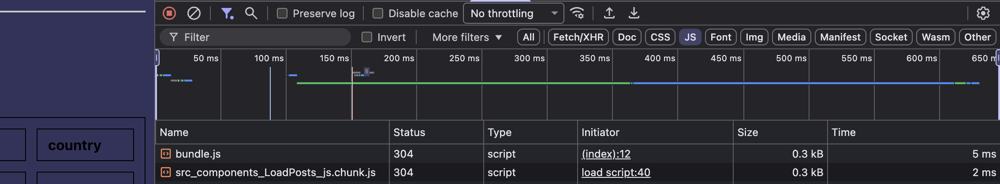
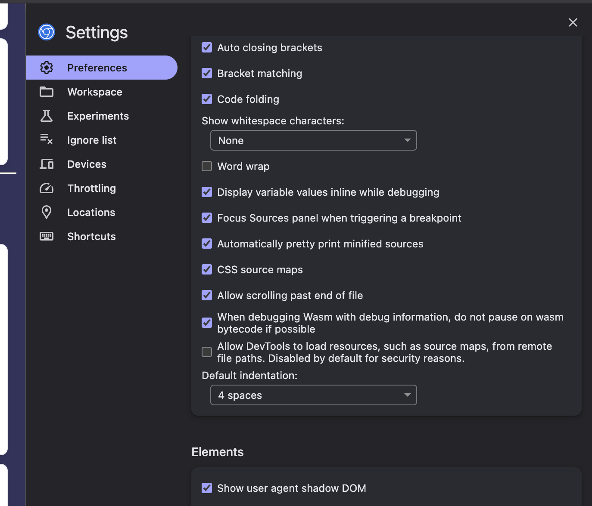

# 1.JSX
It supports jsx , allow to use / write html code in js

const element = `<h1> hello </h1>`;
<!-- jsx complied by bable into normal js -->

const element = React.createElement("h1",props,"hello"); props -> {className:"abc", onClick : handleClick}

-> bable will convert new js sytanx into older js sytanx
  ex: arrow functions, promise, higher order functions (map, filter, reduce), Promise , object.assign

rules :
1. if we have multiple elements , there should be a parent element for them
 <h1> hello <h1>
  subtitle  -> invalid
<>
<h1> hello <h1> 
  subtitle   -> valid
 </>

2. className instead of class
3. if ur using javscript with html { isLoggedIn && <Dashboard/>}

4. Self closing tags
    

# 2.Single Page Application (SPA)
Meaning it is sinlge page that is index.html , using bundle it will render all react componets script which is added in index.html, it has root element from which we render all react components 

# 3. Advantages (SPA) 
  * Easy to route , no page reload when routing happens.
  * Component based ui
  * Centralized state mangement (Context API, Redux, Zustand)

# 4. Client side rendering
  Download bundle on intial load of web page , more initial load time

# 5. Server side rendering
    Some html like initial html rendered from server , directly get html , disply to user, increase initail load time 

  1. Hydration -> react attaches event listeners to html
  2. We will load only initial fdata from sever, header, footer , hero contetnt , initial list 

# 6.Stateless components
  compomets which does not have their own state are stateless components, example like Card, button, icon, label
  check Button.js component 
  -> Reausable components - buttons, cards , layouts which doesnot have life cycle and also useState will not be  dused

# 7. Pure components 
  componets which will re render only when their own props get changed, in functional components we can achive this by using memo
  check Button.js component 

# 8. Composable components 

  We divide large component into smaller one , use them inside one component (main) -> we call it as composed component
  Check Layout.js component

# 9.Children props

<Header>
  <h1>
  Some text (this is children props)
  </h1>
</Header>

const Header = (props) =>{
  
 return (<>
  {props.children}
  </>)
} 

check layout component

# 10. Fragments
  Used to group multiple elements , without adding new dom node
  check Header component

# 11. Keys in lists

# 12. State
# 13. Props
# 14. State vs Props
# 15. Why state should not update directly

React understand or detect changes only when state value is get updated wit setter functions , if we are updating value directly value will be updaed but react will not detect this, re-render of component will not hapeen, this majorely affect pure components

# 16. Lifting state

lets take example three components: Parent, ChildA , ChildB

If we are using state variables inside ChildA then we are not able to access it in ChildB , Parent component `we can achive this by using callback`, but simple way is move state values to parent and pass it to both child this is what we called as Lifting state

# 17. Props Drilling

Props drilling is related to passing data to children by props, if we have one Parent compoent and n children components if nth or n-1 children needs data it has to pass throgh all n components to reach n , this what we call it as Props Drilling, we can resolve this by `Redux, Context api`

# 18. Prevent default

Check Form component

# 19. Event Capturing
  `top -> target` onClickCapture -> click happens child onClickCapture
Check Common Component

let say two components

parent
  
child

on capture parent -> then child

# 20. Event bubbling
  `target -> top` onClick -> click happens child onClick
Check Common Component

# 21. stopPropogation 

Check Common Component

# 22. Controlled Components

Check ControlledComponent

# 23. UnControlled Components

Check UnControlledComponent

# 24. Refs vs Controlled Components
If u are having only one ref in ur componet which treated as uncontrolled component

# 25. useState

# 26. useEffect

# 27. useEffect cleanup

# 28  Dependency Array

# 29. useRef 
  check un controlled component

# 30. useMemo 

Check users component -> handling search with user list use only when dependency is getting changed less frequently and also don't use for smaller calculations, for smaller inputs

# 31. useCallback

Check counter Counter component , use when passing as props to other components , use only when dependency array values changes less frequently and also child components should be memoized the only use

# 32. Context API

CHeck Theme toggle and app.js

# 33. Custom Hook

Custom hook is used create function which handle functionlity , return value which is shared across other components, we can create custom hooks for api call, debounce, throttle many things 

Custom Hook Rules
  1. Custom hook should start with use, because react undersatnd hook with use naming conventions
  2. Allways call hooks on top of component
  3. Custom hooks can be used inside other hooks or/ in components not in normal functions
  4. Custom hook share logic, not state

CHeck todoList Component

# 34. When not use useMemo / useCallback

  -> small task 
  -> dependency varables change very frequently
  -> child component not memoized

# 35. Component lifecycle phases

  1. Mounting
  2. Updating
  3. Unmounting

# 36. Mounting phases

  # Class component
  1. constructor() -> initalize methods, states, and bind method
  2. getDerivedStateFromProps() -> before render
  3. render() -> render dom data
  4. componentDidMount()-> after component render (side effects (asyn logic, api call, background task, timers))

  # funtional component
  useEffect(()=>{}) - every render called
  useEffect(()=>{},[]) -> only one time

# 37. Updating phase

  # Class component
  1. constructor() -> initalize methods, states, and bind method
  2. getDerivedStateFromProps() -> before render
  3. shouldComponentUpdate() -> always true , u can make false to avoide re-rnder
  4. render() -> render dom data
  5. componentDidUpdate() -> same componentdid mount , we can get pre props and new props
  6. getSnapShotBeforeUpdate()

  # funtional component
  useEffect(()=>{},[value]) called when value change

# 38. Unmountning (cleanup, timers, event listners)

  # Class component
  componentWillunmount

  # funtional component

  useEffect(()=>{

    return () =>{
      cleanup logic
    }
  },[])

# 39. Error Boundries

  # class component

  check error boundry component

# 40. Strict Mode

Strict mode only enabled in development ,not in production, to check proper cleanup is happeing , early issues

`mounting -> unmounting -> mounting`

# 41. Virual Dom

# 42. Diffing algorithem

  element defination 
  1. type
  2. props
  3. key
  4. refrence

  {"type":"div",props:{childrens:[{"type":"h2"},props:"Hello"]}} 

  # using above DOM tree is constructed 

  # Diff algo compare type 
  1. if element is diffrent div -> span , replace with new 
  2. if data / props change update it
 

# 43. Reconcialation 

  Same uses diffing algorithem

  1. update virtual dom
  2. then minimal changes moved to Real Dom 
  3. Reflow 
  4. Repaint

# 44. How React renders

  1. load index html
  2. html and css
  3. From html -> element defination contruct DOM tree and CSSOM tree
  4. Render tree
  5. Reflow (layout)
  6. Reapint

# 45. Reflow (layout calculation)  expensive task affect perfomence

  1. Calculate dimensions (height, width, padding, margin, border)
  2. when font size change reflow happens
  3. when element added / removed
  4. animations

# 46. Repaint expensive task affect perfomence , less expensive compare to reflow

  1. When background image / color change
  2. transition effects // smmoth change between state
  3. color change

# 47. React fiber (16+)

  React fiber is asynchronous , where before react fiber dom updation is synchronous, larger task will cause ui load take time, laggy inputs, we can't preioritize tasks

  React fiber allow to pause, resume, interrupt VDOM update, resume it later , priorities task

  React fiber break rendering into smaller chunks, prioritise , pause , resume chunks, which will not freeze ui
  larger renders

  rendering schedule like divinding rendering into smaller chunks

  1. click and type 1st priority
  2. animations
  3. data render

  It has two phases
  ------------------
  1. update phase -> render divinde into smaller chunks , priorities chunks, pause, resume chunks
  2. commit phase -> final phase where changes are moved to real dom where actual tree get constrcucted

# 48. Why virtual dom is faster 
  because vitual dom will have tree like structure , it is json object elemen defination check diffing algorithem
  so comparison is easy no tree construct here, and no `Reflow and Repaint`, this happens only in RealDOM

# 49. Batch updates

    React 16+  -> render once
    setCount(c=> c+1);  
    setFlag(f=> !f);

    render twice  (promises, async opertions, api calls, timers)
    --------------
    setTimeout(()=>{
    setCount(c=> c+1);  
    setFlag(f=> !f);
    },100)

    React 18+ supports for (promises, async opertions, api calls, timers) -> render once
    -----------------------------------------------
    setTimeout(()=>{  
      setCount(c=> c+1);  
        setFlag(f=> !f);
      },100)

# 50. React memo (pure component shallow compare)
    check button component

# 51. Throttling

  pause clicking / triggreing of any event for some duration , after that we enable it

  Example: we have click event , in that event we are calling api, if don't add throttling user can click multiple times api will triggre that many times causes server load, basically we are preventing user to wait for response then we are allowing againt to click

  Check LoadPosts component

# 52. Debouncing

  we will not perfom any taks until user leaves the input, aftet user levaes input in some miliseconds we trigger functionality

  Example: Search input calls api , every text enter with debounce we stop triggreing api every text enter we will just trigger api ater user stop / leave typing

  Check users component

# 53. Virualization (react window)

render only the items which are visible in viewport , increase performence for larger list

Check company data component

# 55. Lazy rendering

  Render component by using some flag like isVisible , loaders, it is diffrent from lazy loading
  
  Bundle is loaded initially only component get loaded when flag is enabled  like loaders , modals etc

# 56. Code splitting

  we have one component or multilple component which involves large functionality so we can split code 

  Example: Dashboard component is involves large functionality if genrate bundle with this compoent bundle size will increase

  Single bundle
  -------------
  main.js -> 30MB

  code split
  ----------
  main.js - 10 mb
  dashboard.js -> 10 mb
  articles.js -> 5mb
  comanyInfo.js -> 5mb

  Code splitting increase initial load time because rest components get loaded when they need

# 57. Lazy loading (React.lazy())

code splitting can be achived using this react,lazy

Check load posts component in  app.js

# 58. Suspense 
suspense is used to show fallback ui until child component get loaded it used on top of lazyLoaded compoent
Check load posts component in  app.js

# 59. Routing (react-router-dom) seperate package

Check app component and router component

# 60. Route level lazy loading

check users component and routes

# 61. component level lazy loading (same which has component has time taking mostly in dashboards)

# 62. Image lazy loading

Check ImagelLazy component

# 63. Client side routing 

Implemeted in routes compoent

# 64. react router

# 65. Nested Route

adding route inside another route

check route
nested route should be relative not absolute
 <Outlet> component should be included in parent then only works

 # 66. Route based code splitting

 check Router component

 # 67. Context api
 
 Built in react statemenagement library 
 check App.js 

 # 68. Redux (redux toolkit)

 redux flow
 ----------
 dispatch -> action -> reduces -> update store -> re-render components consuming state

 Global State management library for react application , it works on three key features

  1. Store -> single store object holds entire application data
  2. Actions -> tells what action to be performed
  3. reducer -> perorms action

  Redux tool kit -> normal redux configuration is complicated, redux toolkit make it simpler

  Check todoapp and todo slice

# 69. Redux middle ware

  redux provides middleware support for handling sideeffects

  1. Async opertions
  2. Api calls
  3. Timers

# 70, Middleware types

  1. Redux Thunk -> perform async opertions using action functions
  2. Redux saga -> perform async opertions using genrator functions

# 71. contextAPI vs redux

  1. context api is light weight , it is built in. redux is sepearate package
  2. context api does not support middle ware. Redux supports middle ware
  3. Context api for small apps. Redux is for large apps
  4. examples context api -> theme , user session, localisation (launguage)
  5. examples redux -> amzon , flipakrt , nextiva app

# 72. when not use redux

  Smaller apps , increase app size 

# 73. Concurrent rendering (React fiber 16+)

  pause, resume, itterupt and priorty updates, already discussed above

  it will included in react app when we create root in starting

  1. startTransition -> handle low priorityupdates

    startTransition(()=>{
      setFilteredData();
    })

  2. useTransition 
    const [isPending, startTransition] = useTransition();
    ->Avoide ui Freeze
    ->show loading

  3. useDeferredValue  // postpone

    1. we can say debounce , but in debounce we have settimeout, we are delaying api call
    2. but in deffered we don't have any specific delay time
    3. useDeferredValue will not be used when we are performing search at API level
    4. useDeferredValue is useful for FE performence optimize

    const deferredSearch = useDeferredValue(searchTerm);

    ->Renders stale value temporarily
    ->smooth typinh

  4. Diffrence between startTranstion and useDeferredValue
    1. startTranstion -> it will delay upadting states means non urgent rendering
    2. useDeferredValue -> updated deferredSearch value slowely so that we cn use it later

# 74. Automatic batching

  React 16 > and < 18 will support only state update batching

  setInput1(1); 
  setInput2(2);  -> component re-render happens only once this we will call batching

  setTimout(()=>{
    setInput1(1);  -> if we are doing within timers or async calls automatic batching will not work
    setInput2(2);
  })

  react 18 less < batching is not supported for timers, promises ,api calls 

  setTimout(()=>{
    setInput1(1);  ->  automatic batching will work in react 18+
    setInput2(2);
  })

  React 18+ supports

# 75. Streaming SSR

    Initially render page -> download data -> return it to browser as webpage

    using streming SSR
    -------------------
    send shell html -> send data by chunk, so progressively data visible to user
   
    used in nextjs

# 76. React server components (nextjs)

  basically next js loads all components on server by default, we have use  `use client` to make it client interactive

# 77. Shadow Dom

  It encapsulate html, style, javscript and ut will not disturb outside html, and also this will not be affected from outside html

  example: <input>,<select>,<audio>, <video>, 
 are implemnted by shadow dom (similar to react components)

  

  enable this to see shadow dom in elements

# 78. Event delegation

  If we rendering list of items , which has same event listner what event delegation do is add event listner to parent, so it will synchronousely bubble child to parent

  1. delegation will not applied for immedietely happening events -> In SSR , html got rendered but hydration is not done, but user clicks event this will not be delegated
  2. not for `focus` and `blur` events because they won't bubble

# 79. Synthetic events vs native events

  we know in js click event will be written like `onclick` , most browser have same sytax but some of them `click` so react created a wrapper over them and use `onClick` event 

  1. Native events -> click, change, scroll, keyDown etc
  2. Sythentic events -> onCLick, onChange, onScroll, onKeyDown
  3. React created a wrapper for events over native events called sythetic events
  4. e.nativeElement

  it has som propoties
  1. e.target
  2. e.current
  3. e.stopPropagation
  4. e.preventDefault

  example: function handleClick (e){
    console.log(e) => Synthetic
    console.log(e.nativeEvent) => native evnt
  }

# 80. why keys should not be index

  Example : with index List [
    A -> 0
    B -> 1
    C -> 2
  ];

  if new `X` is added

  List [
    X -> 0 -> but react think A -> 0
    A -> 1 -> but react think B -> 1
    B -> 2 -> but react think C -> 2
    C -> 3
  ];

  So this will confuse react , react will do unncessary renders , this will effect performce

# 81. why use effect runs twice in strict mode

  we know strict mode is only work in dev enviormnet , to check cleanup is happening , some errors are there or not

  `mount-> unmount -> mount`

# 82. Props mutation anti pattern

  we know props are read only if we try to update props value it will through an error

# 83. state mutation issues

  we know react will understand state update only happens using setter functions, it will effect pure components

# 84. Context re-render problem

  Context api is used to share data between childrens 

  if some of children not consuming data also get re -render

  solution is
  1. use-context-selctors -> select only value we are using
  2. splitting context

# 85. SEO challenges in react

  1. We know react is spa it will initially load index html which has `root` element only
    so bot crawlers/ web crawlers will not get any thing, search engine may not index content properly
  2. No Dynamic meta tags
      nextjs support `head` tag where we can add meta tags
  3. spa routing

    agiain not all data will be displayed so bot crawlers/ web crawlers will loss data

  4. if js fails or slow crawlers skip execution
  5. button navigation instead anchor element

  solution serverside rendering

# 86. Pagination vs Virtulisation

  pagination -> pagination solves BE server load problem , n/w bandwidth  

  virtualisation -> completly for frontend like if have larger list but we have fixed window size when we scroll it will append load all data what happens flickering will come in  ui if virtualisation not there, so virualisation solves if you scroll down new elements will be appended to list and older get removed 

# 87. Hydration

  1. Hydration will happens in SSR
  2. we know when we are rendering content from SSR , HTML will get loaded from server, but there will be no client intercation like click, inputs or other events 
  3. Hydration will attach events to html
  4. like if we have click event but normal html 
 click 
 -> here no click events
  5. after hydration 
console.log("click")}> click 

𝗝𝗮𝘃𝗮𝗦𝗰𝗿𝗶𝗽𝘁 (𝗖𝗼𝗿𝗲 𝗗𝗲𝗽𝘁𝗵)
1. Explain the JavaScript event loop. Microtasks vs macrotasks?
2. Implement Promise.all from scratch.
3. Implement debounce and throttle.
4. Explain closures with a real-world example.
5. How does prototypal inheritance work?
6. Difference between var, let, and const.
7. Difference between == and ===.
8. Explain shallow copy vs deep copy. Implement deep clone.
9. How does this behave in arrow functions, class methods, and event handlers?
10. Explain call, apply, and bind with use cases.

𝗥𝗲𝗮𝗰𝘁 (𝗜𝗻𝘁𝗲𝗿𝘃𝗶𝗲𝘄 𝗗𝗲𝗽𝘁𝗵)
11. What is reconciliation? How does React diffing work?
12. Why are keys important in lists?
13. What causes unnecessary re-renders in React?
14. Explain useEffect deeply. Cleanup? Dependency array pitfalls?
15. Difference between useMemo and useCallback.
16. When would you use React.memo?
17. Controlled vs uncontrolled components.
18. What is state batching? What changed in React 18?
19. How does React Context work? When can it hurt performance?
20. Build a custom hook like useDebounce or useFetch.

𝗙𝗿𝗼𝗻𝘁𝗲𝗻𝗱 𝗦𝘆𝘀𝘁𝗲𝗺 𝗗𝗲𝘀𝗶𝗴𝗻 (𝗦𝗲𝗻𝗶𝗼𝗿 𝗥𝗼𝘂𝗻𝗱)
21. Design an autocomplete search with debouncing and caching.
22. Design an infinite scrolling feed.
23. How would you optimize a slow React application?
24. How would you improve Web Vitals (LCP, CLS, INP)?
25. Design a reusable component library for a large team.
26. How would you handle API failures and retries gracefully?
27. How would you implement dark mode across the app?
28. Redux vs Context vs Zustand, how do you decide in a large-scale application?
29. How would you prevent XSS, CSRF, token leakage, and secure authentication flows in a frontend app?
30. How would you design SSR/SSG or hydration strategy for a React application? When would you use each?

𝗗𝗦𝗔 (𝗙𝗿𝗼𝗻𝘁𝗲𝗻𝗱 𝗥𝗼𝘂𝗻𝗱)
31. Maximum sum subarray (Kadane’s algorithm).
32. Sliding window maximum.
33. Merge k sorted linked lists.
34. Detect a cycle in a linked list.
35. Longest palindromic substring.
36. Design and implement an LRU Cache.

𝗛𝗶𝗿𝗶𝗻𝗴 𝗠𝗮𝗻𝗮𝗴𝗲𝗿 𝗥𝗼𝘂𝗻𝗱
37. Explain a frontend project you built end-to-end.
38. Describe the hardest production bug you fixed.
39. How do you balance performance vs feature delivery?
40. How do you handle disagreements in technical decisions?

Here are some resources to help you out:
1. MDN Web Docs
 - https://lnkd.in/d3Ux-cqV
2. Scrimba React Course
 - https://lnkd.in/d8GyaqDR
3. Frontend Interview Handbook
 - https://lnkd.in/dafdY3GP
4. The Odin Project
 - https://lnkd.in/dXTUSXRZ

# 88. React portals

Allow to render component outside of its parent DOM heirachy, but still it remains part of same react component tree

This is useful when use ui component like Modals, Tootips, dropsowns or popups should appears outside of its parent container

we try to render these components inside parent problems

1. overflow: hidden
2. z-index issues
3. layout restrictions 

will not allow this component get render outside

React portal is solution where we can render these components outside parent component

sytax :  ReactDom.createPortal(modalCode, container);

1. modal code -> whatever html code ur rendering , 
2. conatiner -> element where we are rendering

bubbling will work throught react tree

check Modal.js 

# 89. PropTypes or prop validations

1. This is props type validation , menas lets i have User component  
2. It is accepting name props 
3. let's say some one passed value 10 for name props, so we need here string value but got number value
4. throw an error that is called prop types 
5. we know type check will be done at complie time in typescript 
6. proptype check will be done at runtime 
7. this is required if we are writting js components not for typescript component
8. typescript and propsTypes solves same problems
9. propstype run time warning
10. typescript check complie time error

# 90. Virtualisation or react window

  1. React window -> which is using libraray
  2. Custom virtualisation

    1. Window height -> 400px
    2. Item height -> 40px
    3. scrollTop -> which will give item postion to go top
    4. totalHeight -> itemHeight * items count
    5. startIndex -> Math.floor(scrollTop/itemHeight);
    6. visibleCount -> Math.ceil(height/itemHeight);
    7. visibleItems -> slice(startIndex,startIndex+visibleCount+1) -> +1 for avoiding flickering
    8. offsetY -> startIndex * itemHeight -> smooth scroll
    9. div -> enable verticalScroll , height : window height
    10. div -> to enable scrolling  height:totalHeight
    11. div -> smooth scroll transform: `tranformY(offsetY px)`

# 91. Custom progress bar

# 92. Virtul DOM object structure

  

      <h1 className="heading">Hello world</h1>
  

  1. VDOM object: 

   {
    type:"div",
    props:{
      id:"container",
      className:"box",
      children:[
        {
          type:"h1",
          props:{
            className:"heading",
            children: "Hello world"
          }
        }
      ]
    }
   }

# 93. Reconcillation

  1. Comparing old DOM and bew DOM

  2. When props/ state change component re render
  3. Create new VDOM and compare it with Old VDOM -> update only changed parts
  4. Uses diffing algorithem to comapre
  5. if only value updated , just update value
  6. if element got change , replace with new element and its child elements are re-renderd
  7. Keys -> if we have list of items to render in ui we will iterate elements and show them
  8. why use keys because to avoide unnecessary DOM updates

  9. exmaple 1
    ["A","B","C"] -> ["A","X","C"]

    if we don't use keys

    items.map((item)=>
{item}
)

    here it will create three dom upadtes instead of only one

  10. example 2
      [
        {
          id:1,
          value:"A"
        },
        {
          id:2,
          value:"B"
        },
        {
          id:3,
          value:"C"
        }
      ]

        items.map((item)=>
{item}
)

        if B->X only the element which got updated will be updated in DOM

        and also we have to use unique values which will not change every render for keys, because if every re-render keys change then no use for keys , performence will be affected

# 94. Avoide un-necessary re-renderes

  1. Memo
  2. useMemo
  3. useCallback
  4. Avoide using inline functions

    
 handleClick()}> // wrong

    
 // good

  5. Don't use state if we are not using that value in UI, use ref store values
  6. use keys for list
  7. split components 

# 95. form in react

# 96. Infinite scroll

# 97. Higher order components

  component which accepts another component as argument and return new component

# 98. forwardref

# 99. Create todo app using pure js

# 100. Image optimization

  1. Choose modren formats 

    1. WebP / AVIF -> small size and high quality
    2. png
    3. jepg

  2. lazy Loading

     

  3. Responsive images

    Diffrent sizes for diffrent screens

  4. Image Compression

  5. use cdn

  6. use svg for icons

# 101. LCP (loading speed), FID (interactivity)

  1. lazy load image, cdn, caching, responsive, standard format webP, use svg for icons
  

  2. code splitting, reducing initial loading time

  3. reduce bundle size
  4. use caching
  5. Unnecessary re-renders
  6. server side rendering

# 102. prevent XSS

  1. Do  not use dangerousHTML, use DOMPurify
  2. CSP -> block inline scripts from unkown source
  3. use same-site cookies
  4. avoide token leakage (localstorage , session storage)
  6. set in http-cookies
  7. avoide exposing tokens in urls, queryParams
  8. input validation (FE+BE)
  9. Rate limiting DDOS
  10. Avoide inline scripts
    

# 103. Unit and integration

1. jest -> javascript libraray which already comes with RTL 
2. test, expect -> jest .toHaveTextContent();
3. screen, render and if any click events fireEvent from RTL

# useEffect vs useEffectLayout

1. Runs after broweser paints 
2. Does not block ui rendering
3. used for data fetching , logging, subscriptions

1. Run synchronousely after DOM updates but before browser paints
2. Blocking delay paint until it finishes
3. Best for measuring dom, animations and layout calculations

# fetch vs axios

1. json -> manual in fetch and autometic in axios
2. Error handling  -> fetch((res)=> if(!res.ok) throw new Error("error"))  axios(path).cacth(err=>console.log(err))
3. timeout support ->  support in axios, fetch not
4. interceptor -> support in axios, fetch not

# react router

1. Library used to route between pages without refreshing page because react is SPA 

# browser route vs hash router 

1. /about vs #/about
2. seo friendly -> yes vs no
3. clean url -> yes vs no

# Model, view and controller

1. Model -> Data 

  const user = {
    name:"nizam",
    role:"Admin"
  }

2. view -> UI 

  
{user.name}

3. Controller -> functions

  function updateUser(user,role){
    user.role = role;
  }

4. User -> UI -> controller -> updates Model -> view (UI)

# HTML5

1. Sematic elements

  1. <header>
  2. <footer>
  3. <nav>
  4. <article>
  5. <aside>
  6. <section>

2. multimedia support

  1. <video src="path.mp4" controls="true"></video>
  2. <audio src="path.mp3" controls="true"></audio>

3. Canvas

  1. <canvas id="myCanvas"></canvas>
  2. charts 
  3. signature
  4. animations

4. geolocation

5. webstorage

  1. localstorage
  2. session storage

6. better seo
7. mobile friendly

# CSS3

1. Advance selectors

  div > p { color: red; }  // direct child

2. color gradient

  background: linear-gradient(to right, red, blue);

3. Flexbox

4. Grid

5. Transitions -> smooth changes

6. media queries

@media (max-width:768px){
  body {
     background: lightgray;
  }
}

7. shadow effects

# data binding

1. one way data binding

let name = "nizam";

{user.name}

2. two way

const [name,setName] = useState("");

<input type="text" value={name} onChange={e=> setName(e.target.value)}/>

3. one time

const name = "Nizam";

# latest react version 19.2

1. server components rendering

2. handle promises directly (use) => fetch.then(res).catch() , new use(fetchuser()) => error will be handled by nearest error boundry

3. React compliler (optimize performnce)

# SAP Spectacles (SAP fiori) -> Design principles

1. Role based

  1. Apps are dsigned for specific users
  2. Dashboard and report for Admin
  3. Task screen for employee

2. Adaptive 

  1. works for all devices (mobile, tablet , desktop)
  2. Responsive ui

3. Simple

  1. Only necessary information shown
  2. fever clicks

4. coherent

  1. Same design across all apps
  2. consistent experience

5. Delightful

  1. smooth animation and faster performence

# SAP fiori (UI layer)

1. Built using SAP 5 or OpenUI5
2. Javascript
3. HTML5
4. CSS3

# OPENUI5 

1. It works on MVC architecture

2. Model, view and controller
3. Model  -> Data
4. View -> UI (Xml)
5. controller -> js functions
6. User -> view -> controller -> update model -> view
7. OData service which connects FE and BE (GET, POST, PUT, PATCH, DELETE)

# Accessbility (aria -> Accessible rich internet application)

1. Screen readers will read website
2. If we don't provide or used proper elements it will not read properly
3. blind persons will interact application by pressing keys like (tab, enter, arrowkeys)
4. We have to use sematic elements
5. define proper tab index order
6. if we are using div tags instead button for click add aria-label, role
7. create input with labels
8. show dark text in plain background
9. High contrast text
10. Use alt text for images

# SEO 

1. web crawls read out html page
  1. Read
  2. understand
  3. Index

2. start with HTML page
3. CSS and JS
4. Execute js
5. store content in search DB (index)
6. Important tags

  1. h1 - h6
  2. title
  3. meta tag
  4. img alt

7. links
8. metadata

